# Ferrix apps

> A component of [Ferrix](https://github.com/ferrix-os/ferrix), checked out at `src/user/apps` (its `components.toml`); build and test it from there with `cargo xtask`. Ferrix's [conventions](https://github.com/ferrix-os/ferrix/blob/main/docs/CONVENTIONS.md) apply, including one author per commit.

The programs a person starts on Ferrix, one folder each, described by its
`app.toml` ([docs/APPS.md](https://github.com/ferrix-os/ferrix/blob/main/docs/APPS.md)).
xtask finds every folder here and builds, gates, packages and installs it by
what its `app.toml` says; `cargo xtask apps` lists them.

<table>
  <tr>
    <td width="33%"><a href="term/">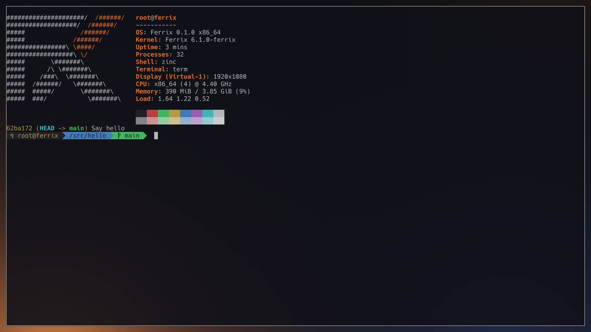</a> <b><a href="term/">term</a></b></td>
    <td width="33%"><a href="foot/">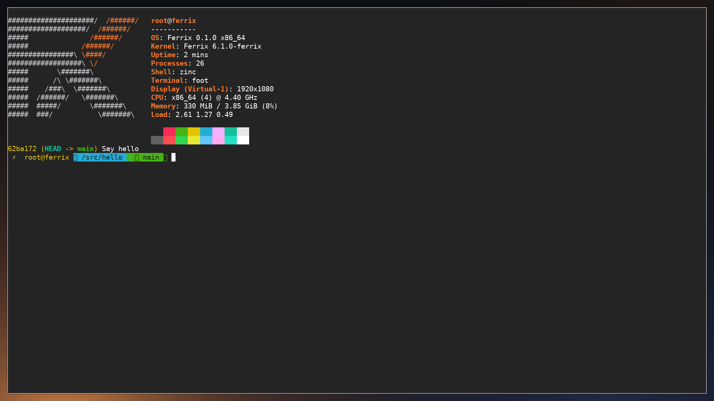</a> <b><a href="foot/">foot</a></b></td>
    <td width="33%"><a href="waybar/">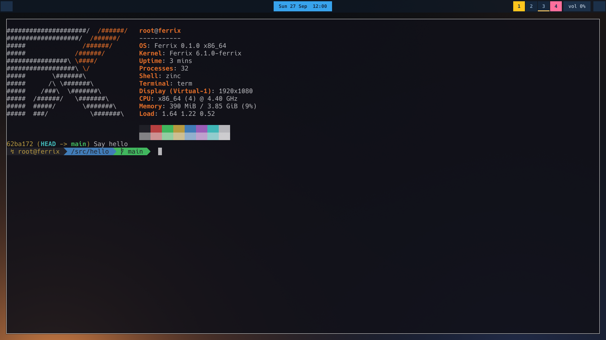</a> <b><a href="waybar/">waybar</a></b></td>
  </tr>
  <tr>
    <td width="33%"><a href="fuzzel/">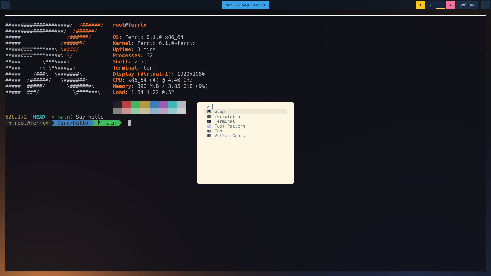</a> <b><a href="fuzzel/">fuzzel</a></b></td>
    <td width="33%"> <b><a href="hyprlock/">hyprlock</a></b></td>
    <td width="33%"><a href="hypridle/">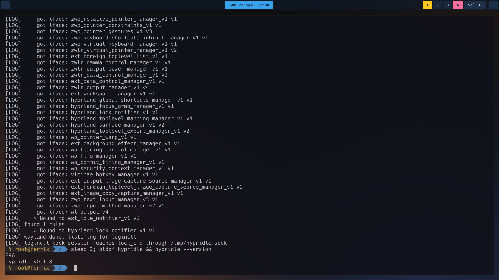</a> <b><a href="hypridle/">hypridle</a></b></td>
  </tr>
  <tr>
    <td width="33%"> <b><a href="ferrofetch/">ferrofetch</a></b></td>
    <td width="33%"><a href="btop/">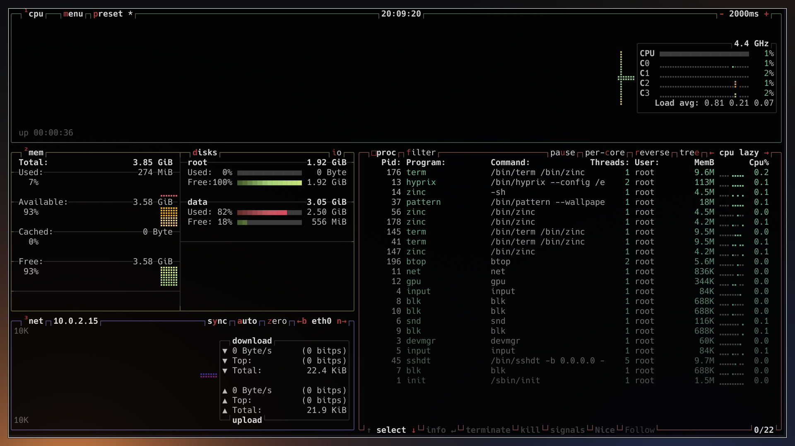</a> <b><a href="btop/">btop</a></b></td>
    <td width="33%"><a href="vkgears/">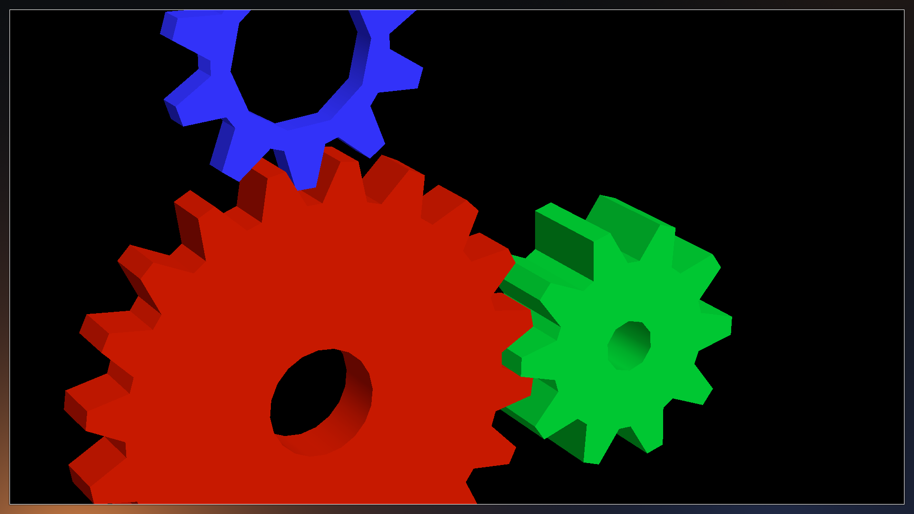</a> <b><a href="vkgears/">vkgears</a></b></td>
  </tr>
  <tr>
    <td width="33%"> <b><a href="curl/">curl</a></b></td>
    <td width="33%"><a href="git/">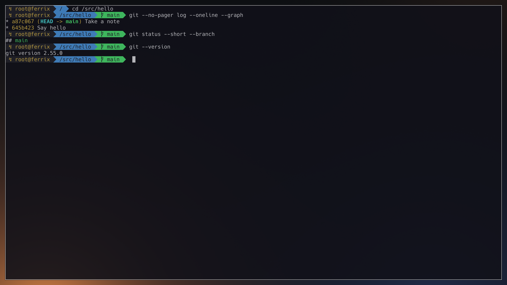</a> <b><a href="git/">git</a></b></td>
    <td width="33%"><a href="statd/">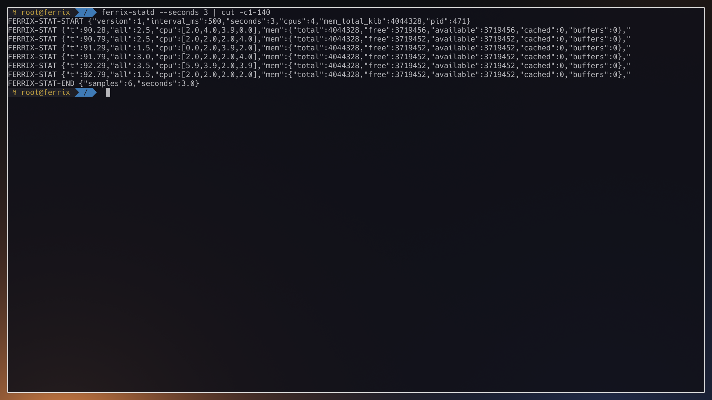</a> <b><a href="statd/">statd</a></b></td>
  </tr>
  <tr>
    <td width="33%"><a href="alsa-utils/">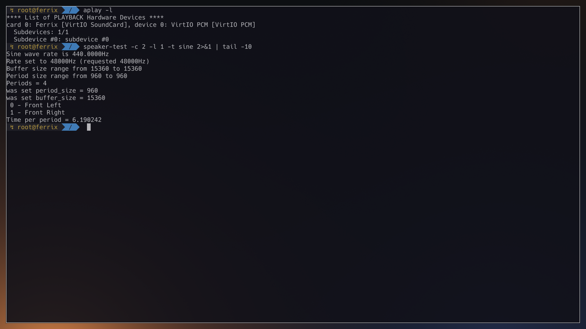</a> <b><a href="alsa-utils/">alsa-utils</a></b></td>
    <td width="33%"><a href="alsa-lib/">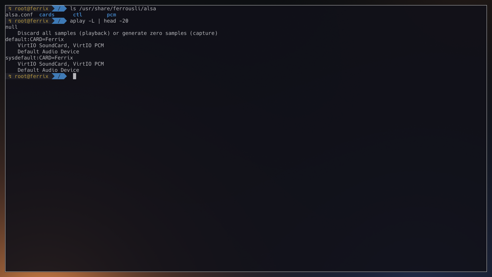</a> <b><a href="alsa-lib/">alsa-lib</a></b></td>
    <td width="33%"><a href="sshdt/">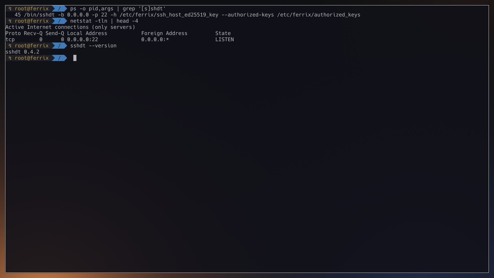</a> <b><a href="sshdt/">sshdt</a></b></td>
  </tr>
  <tr>
    <td width="33%"> <b><a href="badapple/">badapple</a></b></td>
  </tr>
</table>

*Each app's own `screenshot.png`, on Ferrix (x86-64 under KVM): the desktop's clients and foot at main def906ba2 (2026-10-04), the others at 2f067e40f and badapple at fee29d168 (2026-10-03).*

- **The desktop's:** `term`, `waybar`, `fuzzel`, `hyprlock`, `hypridle`, which
  every desktop carries.
- **Ferrix's own:** `badapple`, `ferrofetch`, `statd`.
- **Ported onto ferrousli**, Ferrix's C library, with its `tools/ports/`:
  `alsa-lib`, `alsa-utils`, `btop`, `curl`, `foot`, `git`, `sshdt`, `vkgears`.

A folder depends on Ferrix's crates by relative path from where this repository
is checked out, so it builds inside a Ferrix checkout, not alone.
