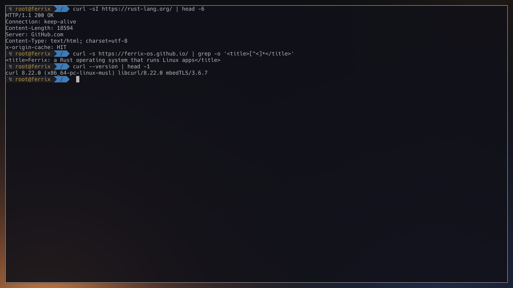

# curl

curl, the URL transfer tool, static against ferrousli with Mbed TLS. An app (Ferrix's [docs/APPS.md](https://github.com/ferrix-os/ferrix/blob/main/docs/APPS.md)): `app.toml` says what it installs and how it is built; its licence is `curl AND (Apache-2.0 OR GPL-2.0-or-later) AND MPL-2.0`.

*curl over HTTPS with Mbed TLS: rust-lang.org's headers, and the title of Ferrix's website. On Ferrix (x86-64 under KVM) at main 2f067e40f, 2026-10-03; nothing edited after capture.*
