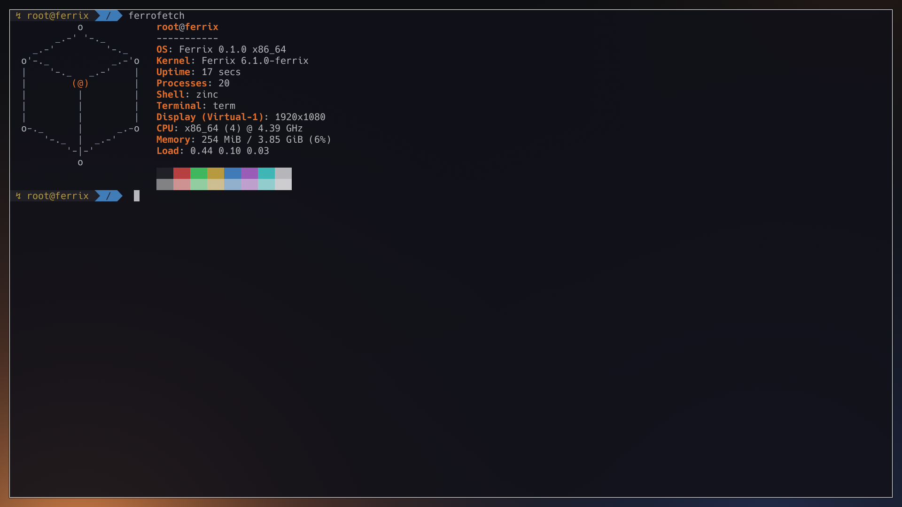

# ferrofetch



*ferrofetch in the desktop's terminal. On Ferrix (x86-64 under KVM) at main 2f067e40f, 2026-10-03; nothing edited after capture.*

Ferrix's fastfetch: the Ferrix mark beside a few lines about the machine,
the shell and the session.

```
            o              root@ferrix
        _.-' '-._          -----------
    _.-'         '-._      OS: Ferrix 0.1.0 x86_64
  o'-._           _.-'o    Kernel: Ferrix 6.1.0-ferrix
  |    '-._   _.-'    |    Uptime: 8 secs
  |        (@)        |    Processes: 6
  |         |         |    Shell: zinc
  |         |         |    Terminal: console
  |         |         |    CPU: x86_64 (4)
  o-._      |      _.-o    Memory: 50 MiB / 471 MiB (10%)
      '-._  |  _.-'        Load: 0.08 0.02 0.01
          '-|-'
            o
```

`ferrofetch --no-logo` prints the lines alone, `--no-color` without the
terminal's colour escapes.

An app (`docs/APPS.md`): everything it is lives in this folder, and xtask
finds it by its `app.toml`.

* `src/lib.rs`, `parse.rs`, `render.rs`, `logo.rs` -- the lib target: the
  parsers of what the kernel's `/proc` and `/sys` say, and the layout. It
  builds on the host, where `cargo test --lib` tests it.
* `src/main.rs`, `sys.rs` -- the program: native, on the runtime, built for
  the kernel's targets. It reads `uname`, `/proc` and `/sys/class/drm`
  through the Linux calls every process has, and writes to the shell's
  descriptors.

The shell is the parent process and the terminal the first ancestor past it
that is not a login step, as fastfetch finds them: Ferrix's `/proc` has no
`environ`, and `$SHELL` names the login shell rather than the running one.

```
cargo xtask apps                      # is it found, does its manifest read
cargo xtask check                     # its fmt, clippy (host and targets) and tests
cargo xtask test-apps --arch x86_64   # a boot that runs its [[smoke]] lines
cargo xtask run                       # an image with it at /bin/ferrofetch
```
