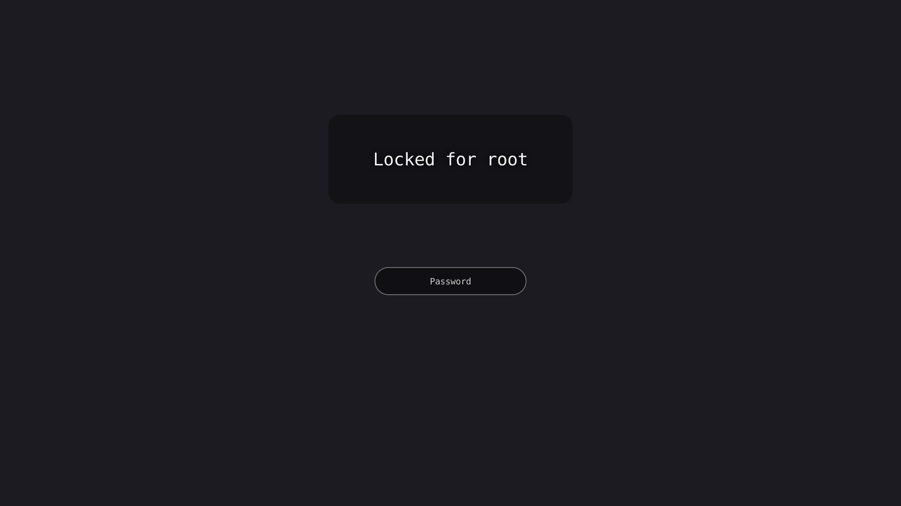

# hyprlock

hyprlock: the user's hyprlock.conf on ext-session-lock-v1 surfaces, passwords checked by authd. An app (Ferrix's [docs/APPS.md](https://github.com/ferrix-os/ferrix/blob/main/docs/APPS.md)): `app.toml` says what it installs and how it is built; its licence is `MIT`. Every desktop carries it whether or not the app is installed.

*hyprlock locking the session for root, its password checked by authd (unlocked again with the password typed). On Ferrix (x86-64 under KVM) at main def906ba2, 2026-10-04; nothing edited after capture.*
